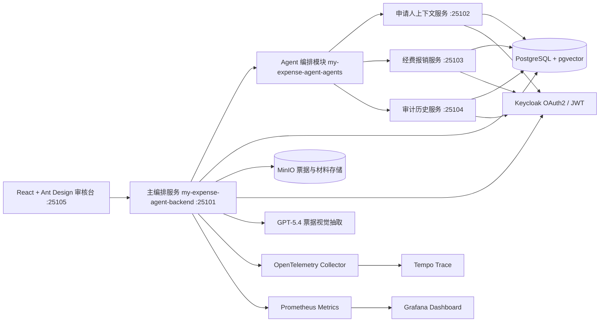

# my-expense-agent


my-expense-agent 是一个面向高校经费报销场景的智能合规审核平台，覆盖学生竞赛、科研训练、实验室耗材、社团活动、会议差旅等校园支出从申请、票据上传、材料识别、制度检索、预算与科目校验、人工复核、审批后入账到审计追踪的完整流程。

系统采用 Spring Boot 拆分主编排服务与业务上下文服务，前端由 React + Ant Design 承载申请、审核、制度、评测和观测工作台。AI 能力通过 RAG、票据抽取、风险解释和 Agent 编排提供审核证据；审批、驳回、入账、权限校验和幂等写入始终由 Java 服务端受控执行，确保校园经费审核过程可追溯、可复核、可恢复。

## 功能范围

### 经费申请与票据材料

- 学生或项目成员创建经费报销申请，填写申请人、学院、项目、经费类型、报销事项、金额和币种。
- 支持 PDF、PNG、JPG、JPEG 票据或佐证材料上传，文件存储到 MinIO。
- 记录票据 SHA-256、对象存储 Key、文件元数据、预览地址、抽取结果和材料状态。
- 支持确定性抽取与 LLM/视觉模型抽取两种模式，便于离线演示和真实模型接入。
- 工作流成功节点会持久化 run、step 和 checkpoint 快照；失败后可从最新成功 checkpoint 恢复，并保留失败阶段、失败原因、事件时间线和可恢复证据。

### 校园制度检索与合规审核

- 支持学校财务制度、竞赛经费办法、创新创业项目经费办法、社团活动经费细则的导入、分块、向量化和版本管理。
- 基于 PostgreSQL pgvector 执行制度 RAG 检索，返回制度片段、章节、版本、相似度和可追溯引用。
- 确定性风险引擎输出风险分值、风险等级、风险信号和审核建议。
- 覆盖项目预算不足或币种不一致、申报金额与票据金额不一致、重复票据、日期异常、销售方异常、材料缺失、禁止报销项目、制度证据缺失、低置信度抽取和票据提示注入等场景。
- 低风险申请可进入通过候选，中高风险申请自动进入指导老师、学院审核员或财务复核队列。

### 人工复核与审批后入账

- 审核员查看待处理任务、风险信号、制度引用、票据抽取结果、预算上下文和工作流证据。
- 支持批准、驳回、要求补充材料和更多信息建议。
- 高风险或疑似违规任务可限制为学院财务或校级财务处理。
- 审批后入账通过受控写 Tool 提交报销登记和经费入账请求。
- 写操作使用 requestId 做幂等保护，避免重复提交和重复入账。

### AI 治理与可观测性

- MCP Tool 分为只读 Tool 和审批后写 Tool，写 Tool 不允许被模型直接触发。
- 记录工作流运行、Agent 步骤、模型调用、Token 用量、Tool 调用和错误信息。
- 前端可查看申请事件流、审核时间线、制度引用和模型证据。
- 内置风险评测、制度 RAG 评测和 Agent 安全评测数据集。
- Prompt 模板支持提交、审核、启用和版本治理，并通过服务端规则阻断越权审批、绕过复核和敏感信息请求。

## 系统架构图



## 模块说明

| 模块 | 默认端口 | 说明 |
| --- | ---: | --- |
| `app/orchestrator/expense-backend` | 25101 | 主业务 API，负责经费申请、票据、制度 RAG、风险审核、人工复核、入账、评测和观测 |
| `app/orchestrator/expense-agents` | - | Agent 编排、MCP Tool 目录、Tool 路由和 MCP 客户端抽象 |
| `app/orchestrator/expense-common` | - | 共享领域状态、错误模型、MCP 安全组件和通用契约 |
| `app/business-api/account` | 25102 | 申请人、学院、项目、角色和预算上下文 REST API 与 MCP 工具 |
| `app/business-api/expense` | 25103 | 经费报销业务 REST API 与 MCP 只读/写入工具 |
| `app/business-api/audit-history` | 25104 | 审计历史、申请事件和操作追踪 REST API 与 MCP 工具 |
| `app/frontend` | 25105 | React + Ant Design 校园经费审核台 |
| `deploy/keycloak` | - | Keycloak Realm 配置和演示账号初始化脚本 |

## 技术栈

| 分类 | 技术 |
| --- | --- |
| 后端 | Java 21、Spring Boot 3.5、Spring Security、Spring Validation、JdbcClient |
| 数据与迁移 | PostgreSQL、pgvector、Flyway、MinIO |
| AI 应用 | LangChain4j、LangGraph4j、MCP、RAG、OpenAI 兼容 Chat / Vision / Embedding 接口 |
| 身份认证 | Keycloak、OAuth2 Resource Server、JWT Realm Role、Audience 校验 |
| 前端 | React 19、TypeScript、Vite、Ant Design、TanStack Query、Zustand |
| 可观测性 | Spring Actuator、Micrometer、OpenTelemetry、Tempo、Prometheus、Grafana |
| 测试 | JUnit 5、Mockito、Testcontainers、Vitest、Playwright |
| 工程化 | Maven 聚合工程、npm、OpenAPI TypeScript 类型生成 |

## 核心实现索引

| 能力 | 代码入口 | 可验证内容 |
| --- | --- | --- |
| LangGraph4j 审核编排 | `ExpenseWorkflowGraphFactory`、`ExpenseWorkflowSteps` | 票据加载、Agent 计划、并行证据收集、风险评估、人工路由和最终状态节点 |
| run / step / checkpoint 恢复 | `JdbcWorkflowRunRepository`、`V13__add_workflow_checkpoints.sql` | 成功节点快照、失败记录、同一 requestId 恢复和旧 step 数据兼容 |
| GPT-5.4 票据抽取 | `LlmExpenseDocumentExtractor`、`ExpenseExtractionValidator` | PDF/图片预处理、结构化 JSON、金额/日期/币种/明细合计校验和确定性降级 |
| pgvector 制度检索 | `PolicyRetrievalService`、`JdbcExpensePolicyRepository` | 按经费类型、地区、申请人类型和生效日期过滤，返回版本及章节级引用 |
| 确定性风险与人工路由 | `DeterministicRiskEngine`、`RiskRoutingDecision` | 预算、金额、重复票据、材料、制度证据、提示注入等风险信号及分级路由 |
| 审批后 MCP 写入 | `ApprovedMcpWriteService`、`ExpenseSettlementService` | 角色入口、审批状态、金额、审批引用和 requestId 幂等校验 |
| 审计与模型观测 | `JdbcModelCallRepository`、`JdbcToolCallRepository`、`ObservabilityController` | 模型版本、Prompt 版本、Token、延迟、重试、Tool 结果和错误码 |

## 风险评测基线

`risk-golden-v2.json` 包含 140 条人工核验的合成案例，其中 30 条为预期高风险案例。当前确定性风险引擎的固定回归结果如下：

| 指标 | 结果 |
| --- | ---: |
| 风险分级准确率 | 92.86%（130/140） |
| 人工复核路由准确率 | 92.86%（130/140） |
| 高风险案例召回率 | 100%（30/30） |
| 风险信号 Precision / Recall / F1 | 1.000 / 1.000 / 1.000 |

10 条误差均来自“严重低置信度但金额及其他事实正常”的边界案例：引擎输出低风险信号，但当前 30 分人工复核阈值不会仅因 25 分低置信度信号触发复核。该差异作为可解释基线保留在评测失败明细中，而不是在展示层隐藏。

复现评测：

```powershell
mvn -q -pl app/orchestrator/expense-backend -am `
  '-Dtest=RiskEvaluationServiceTest' `
  '-Dsurefire.failIfNoSpecifiedTests=false' test
```

## AI 合规审核

`expense-backend` 是平台的审核编排中心。它会读取申请、票据、项目预算、历史报销、制度片段和审计记录，组合为可追溯审核证据。模型只负责抽取、总结、解释和建议，所有影响业务状态的动作必须经过服务端权限校验和状态机校验。

校园经费审核流程：

```text
学生或项目成员创建经费报销申请
 -> 上传票据和佐证材料到 MinIO
 -> 票据结构化抽取
 -> 获取申请人、学院、项目预算和历史报销记录
 -> 检索适用校园经费制度
 -> 计算预算、金额、票据、材料、制度证据和提示注入风险信号
 -> 低风险进入通过候选 / 中高风险进入人工复核
 -> 指导老师、学院审核员或财务人员批准、驳回或要求补充材料
 -> 财务人员发起审批后入账
 -> 记录审计日志、模型调用、Tool 调用和工作流事件
```

制度 RAG 流程：

```text
导入校园制度 Markdown
 -> 输入防护与内容清洗
 -> 按章节分块
 -> 生成 1024 维向量
 -> 写入 PostgreSQL pgvector
 -> 审核时按经费类型、地区、申请人类型和支出日期检索制度片段
 -> 返回可追溯引用作为审核证据
```

受控 MCP 写入流程：

```text
申请已审批
 -> 服务端生成入账请求
 -> 校验角色、申请状态、金额、预算余额和 requestId
 -> 调用经费报销 MCP 写 Tool
 -> 写入报销登记和经费入账请求
 -> 保存 Tool 调用结果和审批引用
```

## 快速开始

### 1. 环境要求

- JDK 21
- Maven 3.9+
- Node.js 20+
- PostgreSQL 15+，并启用 pgvector 扩展
- MinIO
- Keycloak
- 可选：OpenAI GPT-5.4（真实票据视觉抽取）
- 可选：Tempo、OpenTelemetry Collector、Prometheus、Grafana（链路和指标观测）

未配置外部模型时，可启用确定性票据抽取和确定性向量模型跑通核心审核流程。本项目运行时不依赖 Redis、消息队列或 Elasticsearch。

### 2. 准备依赖服务

本仓库不绑定特定操作系统、虚拟机地址或已有容器名称。请自行准备 PostgreSQL/pgvector、MinIO 和 Keycloak，并通过环境变量提供连接信息。下面是本地开发时可采用的端口约定：

| 组件 | 本地地址示例 |
| --- | --- |
| PostgreSQL + pgvector | `localhost:5432` |
| MinIO API | `http://localhost:9000` |
| MinIO Console | `http://localhost:9001` |
| Keycloak | `http://localhost:18080` |
| OpenTelemetry OTLP（可选） | `http://localhost:4318` |

### 3. 克隆项目

```bash
git clone https://github.com/yangaobo0235/my-expense-agent.git
cd my-expense-agent
```

### 4. 配置环境变量

本项目会读取项目根目录下的 `.env.local`，也可以通过操作系统环境变量或启动配置注入。`.env.local` 只用于本地开发，不应提交到 Git。

Windows PowerShell 示例：

```powershell
$env:EXPENSE_DATASOURCE_URL="jdbc:postgresql://localhost:5432/my_expense_agent"
$env:EXPENSE_DATASOURCE_USERNAME="postgres"
$env:EXPENSE_DATASOURCE_PASSWORD="change-me"

$env:EXPENSE_MINIO_ENDPOINT="http://localhost:9000"
$env:EXPENSE_MINIO_ACCESS_KEY="change-me"
$env:EXPENSE_MINIO_SECRET_KEY="change-me"
$env:EXPENSE_MINIO_BUCKET="my-expense-agent-documents"

$env:KEYCLOAK_ISSUER_URI="http://localhost:18080/realms/my-expense-agent"
$env:KEYCLOAK_JWK_SET_URI="http://localhost:18080/realms/my-expense-agent/protocol/openid-connect/certs"
$env:KEYCLOAK_BACKEND_AUDIENCES="my-expense-agent-backend"
```

如需接入 GPT-5.4 视觉抽取：

```powershell
$env:OPENAI_API_KEY="your-api-key"
$env:EXPENSE_EXTRACTION_MODE="llm"
$env:EXPENSE_EXTRACTION_MODEL_NAME="gpt-5.4"
$env:EXPENSE_EXTRACTION_BASE_URL="https://api.openai.com/v1"
```

如需使用 DashScope 生成制度向量，可单独配置：

```powershell
$env:DASHSCOPE_API_KEY="your-api-key"
$env:EXPENSE_AI_EMBEDDING_PROVIDER="dashscope"
```

如果只想离线跑通核心流程，可使用确定性降级模式：

```powershell
$env:EXPENSE_EXTRACTION_MODE="deterministic"
$env:EXPENSE_AI_EMBEDDING_PROVIDER="deterministic"
```

不要提交 `.env.local`、数据库密码、API Key、MinIO Secret Key、Keycloak Client Secret 或其他真实凭据。

### 5. 初始化数据库

首次运行前需要创建数据库并启用 pgvector。数据库账号和授权方式请按本地环境配置，不要在仓库中保存真实密码：

```sql
CREATE DATABASE my_expense_agent;
\c my_expense_agent;
CREATE EXTENSION IF NOT EXISTS vector;
```

业务表由 Flyway 在服务启动时自动创建，统一写入 `my_expense_agent` 数据库。

Flyway 迁移文件按版本追加且不回写历史：`V12` 记录曾用的票据视觉模型，`V14` 将已有环境中的活动票据抽取模板升级为 GPT-5.4；新环境的代码默认值同样为 GPT-5.4。

### 6. 初始化 Keycloak

导入 `deploy/keycloak/my-expense-agent-realm.json` 后，可以执行脚本创建演示账号：

```powershell
powershell -ExecutionPolicy Bypass -File deploy/keycloak/init-campus-users.ps1
```

演示账号规划：

| 账号 | 角色 |
| --- | --- |
| `student01` | 学生申请人，创建经费报销申请和上传票据 |
| `advisor01` | 指导老师，复核项目相关性和材料完整性 |
| `collegeReviewer01` | 学院审核员，处理人工复核任务 |
| `finance01` | 学院财务，审核、入账、Prompt 管理和观测 |
| `auditor01` | 审计员，查看审计记录和工作流证据 |

演示密码和初始化细节以 `deploy/keycloak/init-campus-users.ps1` 为准。

### 7. 启动后端服务

先确认当前终端使用 JDK 21：

```powershell
java -version
```

在项目根目录执行完整构建。本地迭代过 Flyway 迁移文件时建议保留 `clean`，避免旧资源残留在模块的 `target/classes` 中：

```powershell
mvn -q clean package
```

构建成功后，分别在四个项目根目录终端中按以下顺序运行 JAR：

```powershell
java -jar app/business-api/account/target/account-1.0.0-SNAPSHOT.jar
java -jar app/business-api/expense/target/expense-1.0.0-SNAPSHOT.jar
java -jar app/business-api/audit-history/target/audit-history-1.0.0-SNAPSHOT.jar
java -jar app/orchestrator/expense-backend/target/expense-backend-1.0.0-SNAPSHOT.jar
```

常用访问地址：

| 服务 | 地址 |
| --- | --- |
| 后端 API | `http://localhost:25101` |
| Swagger UI | `http://localhost:25101/swagger-ui.html` |
| OpenAPI JSON | `http://localhost:25101/v3/api-docs` |
| applicant-context MCP | `http://localhost:25102/mcp` |
| fund-reimbursement MCP | `http://localhost:25103/mcp` |
| audit-history MCP | `http://localhost:25104/mcp` |

### 8. 启动前端

```powershell
cd app/frontend
npm ci
npm run dev
```

默认访问地址：`http://localhost:25105`

本地开发时如需跳过 Keycloak，可使用开发认证模式：

```powershell
$env:VITE_AUTH_MODE="development"
npm run dev
```

只查看前端交互、不启动后端服务时，可以同时启用 MSW 模拟 API：

```powershell
$env:VITE_AUTH_MODE="development"
$env:VITE_MOCK_API="msw"
npm run dev
```

## 测试与构建

运行后端测试：

```powershell
mvn -q -DskipITs test
```

运行前端检查：

```powershell
cd app/frontend
npm ci
npm run typecheck
npm test
npm run build
```

运行 Playwright 端到端测试：

```powershell
cd app/frontend
npm run e2e
```

检查前端 OpenAPI 类型是否与后端一致：

```powershell
cd app/frontend
npm run api:check
```

`api:check` 会读取 `http://localhost:25101/v3/api-docs`，执行前需要先启动后端主编排服务。

后端接口变化后重新生成类型：

```powershell
cd app/frontend
npm run api:generate
```

## 项目结构

```text
my-expense-agent/
├── app/
│   ├── business-api/
│   │   ├── account/              # 申请人、学院、项目和账户上下文服务与 MCP 工具
│   │   ├── expense/              # 经费报销业务服务与 MCP 工具
│   │   └── audit-history/        # 审计历史服务与 MCP 工具
│   ├── frontend/                 # React 校园经费审核台
│   └── orchestrator/
│       ├── expense-backend/      # 主业务编排服务
│       ├── expense-agents/       # Agent 计划和 MCP 客户端
│       └── expense-common/       # 通用领域模型和安全组件
├── deploy/
│   └── keycloak/                 # Keycloak Realm 与演示账号脚本
├── pom.xml                       # Maven 聚合工程
├── README.md
└── LICENSE
```

## 安全说明

- 模型输出只能作为候选证据，不能直接审批、驳回、入账、转账或修改申请状态。
- 学生只能访问本人或授权项目组的经费申请，指导老师、学院审核员、财务和审计员具备受控的跨申请权限。
- MCP 只读 Tool 和写 Tool 分离，写 Tool 仅在审批后入账阶段开放。
- 所有写入类 Tool 调用必须携带幂等 requestId 和审批引用。
- 证据问答只能基于当前申请证据回答，不能请求密码、Token、银行密钥等敏感信息。
- 开发、测试和生产环境必须使用不同的密钥；生产环境应使用独立密钥、最小权限账号和 HTTPS。
- 生产环境应关闭敏感调试日志，并补充容量评估、权限审计、告警策略和容灾设计。
- 提交代码前请确认 `.env.local`、日志、临时文件和真实凭据未进入 Git。

## 项目边界

- 当前入账流程会持久化内部报销登记和入账请求，未对接真实银行、银校直连或学校财务系统。
- GPT-5.4 仅用于票据结构化抽取；审核摘要和证据问答可配置其他 OpenAI 兼容模型，二者都不能直接改变审批或入账状态。
- LLM/视觉抽取依赖外部模型服务，确定性抽取器主要用于离线演示和降级。
- 内置评测集用于工程质量基线，不代表真实高校财务制度的完整覆盖范围。
- 本项目是学习与作品集项目，生产部署前仍需结合真实校内制度进行二次审计。

## License

本项目基于 [MIT License](LICENSE) 开源。
