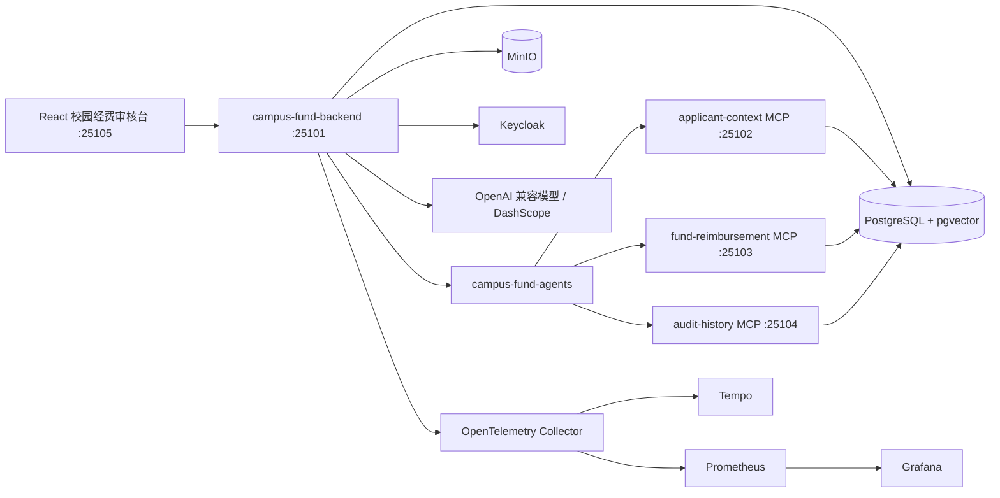

# CampusFundFlow


CampusFundFlow 是一个面向高校项目经费报销场景的智能合规审核平台，覆盖学生竞赛、科研训练、实验室耗材、社团活动、会议差旅等经费支出从申请、票据上传、材料识别、制度检索、预算与科目合规校验、人工复核、审批后入账到审计追踪的完整流程。

系统的核心原则是“AI 提供证据，流程负责决策”。视觉模型、RAG 和 Agent 只生成结构化候选证据、制度引用、风险说明和补充材料建议；状态流转、金额校验、权限判断、幂等保护、人工复核和写入动作全部由 Java 服务端执行，保证校园经费审核过程可追溯、可复核、可恢复。

## 功能范围

### 经费申请与票据材料

* 学生或项目成员创建报销申请，填写申请人、学院/项目组、报销事项、申报金额和币种。
* 支持 PDF、PNG、JPG、JPEG 票据或佐证材料上传，文件存储到 MinIO。
* 记录票据 SHA-256、对象存储 Key、文件元数据、预览地址和提取结果。
* 支持票据结构化抽取，包含确定性抽取和 LLM/视觉模型抽取两种模式。
* 工作流失败后可重新触发审核流程，并保留失败阶段、失败原因和可恢复证据。

### 校园制度检索与合规审核

* 支持学校财务制度、竞赛经费办法、创新创业项目经费办法、社团活动经费细则的导入、分块、向量化和版本管理。
* 基于 PostgreSQL pgvector 执行制度 RAG 检索，返回制度片段、章节、版本、相似度和可追溯引用。
* 确定性风险引擎输出风险分值、风险等级和风险信号。
* 覆盖项目预算超额、经费科目不匹配、重复票据、票据抬头异常、缺少审批材料、支出日期超出项目周期、低置信度抽取等场景。
* 低风险申请可自动进入通过候选，中高风险申请自动进入指导老师、学院审核员或财务复核队列。

### 人工复核与审批后入账

* 审核员查看待处理任务、风险信号、制度引用、票据抽取结果、预算上下文和工作流证据。
* 支持批准、驳回、要求补充材料和更多信息建议。
* 高风险或疑似违规任务可限制为学院财务或校级财务处理。
* 审批后入账通过受控写 Tool 提交报销登记和经费入账请求。
* 写操作使用 requestId 做幂等保护，避免重复提交和重复入账。

### AI 治理与可观测性

* MCP Tool 分为只读 Tool 和审批后写 Tool，写 Tool 不允许被模型直接触发。
* 记录工作流运行、Agent 步骤、模型调用、Token 用量、Tool 调用和错误信息。
* 支持申请事件流，前端可以查看经费报销申请的执行时间线。
* 内置风险评测、制度 RAG 评测和 Agent 安全评测数据集。
* Prompt 模板支持提交、审核、启用和版本治理，防止越权审批、绕过复核和敏感信息泄露。

## 系统架构



## 模块说明

| 模块 | 默认端口 | 说明 |
| --- | --- | --- |
| `app/orchestrator/expense-backend` | 25101 | 主业务 API，负责经费申请、票据、RAG、风险、复核、入账、评测和观测 |
| `app/orchestrator/expense-agents` | - | 多 Agent 计划、MCP Tool 目录和 MCP 客户端抽象 |
| `app/orchestrator/expense-common` | - | 共享领域状态、错误模型和 MCP 安全组件 |
| `app/business-api/account` | 25102 | 申请人、学院、项目和账户上下文 REST API 与 MCP 工具 |
| `app/business-api/expense` | 25103 | 经费报销业务 REST API 与 MCP 读写工具 |
| `app/business-api/audit-history` | 25104 | 审计历史 REST API 与 MCP 工具 |
| `app/frontend` | 25105 | React + Ant Design 校园经费审核台 |
| `deploy/keycloak` | - | Keycloak Realm 配置和演示账号初始化脚本 |

## 技术栈

| 分类 | 技术 |
| --- | --- |
| 后端 | Java 21、Spring Boot 3.5、Spring Security、Spring Validation、JdbcClient |
| 数据与迁移 | PostgreSQL、pgvector、Flyway、MinIO |
| AI 应用 | LangChain4j、LangGraph4j、MCP、RAG、OpenAI 兼容 Chat / Vision / Embedding 接口 |
| 身份认证 | Keycloak、OAuth2 Resource Server、JWT Realm Role、Audience 校验 |
| 前端 | React 19、TypeScript、Vite、Ant Design、TanStack Query、Zustand |
| 可观测性 | Spring Actuator、Micrometer、OpenTelemetry、Tempo、Prometheus、Grafana |
| 测试 | JUnit 5、Mockito、Testcontainers、Vitest、Playwright |
| 工程化 | Maven 聚合工程、npm、OpenAPI TypeScript 类型生成 |

## 核心流程

### 校园经费审核流程

```text
学生或项目成员创建经费报销申请
 -> 上传票据和佐证材料到 MinIO
 -> 票据结构化抽取
 -> 获取申请人、学院、项目预算和历史报销记录
 -> 检索适用校园经费制度
 -> 计算预算、科目、票据和材料风险信号
 -> 低风险进入通过候选 / 中高风险进入人工复核
 -> 指导老师、学院审核员或财务人员批准、驳回或要求补充材料
 -> 财务人员发起审批后入账
 -> 记录审计日志、模型调用、Tool 调用和工作流事件
```

### 受控 MCP 写入流程

```text
申请已审批
 -> 服务端生成入账请求
 -> 校验角色、申请状态、金额、预算余额和 requestId
 -> 调用经费报销 MCP 写 Tool
 -> 写入报销登记和经费入账请求
 -> 保存 Tool 调用结果和审批引用
```

### 制度 RAG 流程

```text
导入校园制度 Markdown
 -> 敏感信息脱敏与输入防护
 -> 按章节分块
 -> 生成 1024 维向量
 -> 写入 PostgreSQL pgvector
 -> 审核时按经费类型、学院、项目角色和支出日期检索制度片段
 -> 返回可追溯引用作为审核证据
```

## 快速开始

### 1. 环境要求

* JDK 21
* Maven 3.9+
* Node.js 20+
* PostgreSQL 15+，并启用 pgvector 扩展
* MinIO
* Keycloak
* Tempo、OpenTelemetry Collector、Prometheus、Grafana
* 可选：DashScope 或其他 OpenAI 兼容模型服务

### 2. 基础组件

当前演示环境部署在 Euler 系统，主机地址为 `192.168.23.66`。基础组件启动命令如下：

```bash
docker start pgvector redis minio expense-keycloak tempo otel-collector prometheus grafana

# 当前 Euler 主机上的可选 Langfuse 独立部署
cd /opt/expense-flow/langfuse
docker compose up -d
```

Redis 与 Langfuse 已安装在当前 Euler 主机，但本版本业务运行时不依赖它们。Redis 可留作后续分布式缓存或限流扩展；Langfuse 可独立用于模型实验，本系统当前的正式审计链路以数据库审计记录和 OpenTelemetry Trace 为准。

常用组件地址可按部署端口映射访问：

| 组件 | 地址示例 |
| --- | --- |
| PostgreSQL + pgvector | `192.168.23.66:5432` |
| MinIO API | `http://192.168.23.66:9001` |
| MinIO Console | `http://192.168.23.66:9000` |
| Keycloak | `http://192.168.23.66:18080` |
| Tempo | `http://192.168.23.66:3200` |
| Prometheus | `http://192.168.23.66:9090` |
| Grafana | `http://192.168.23.66:3000` |
| Langfuse（可选） | `http://192.168.23.66:13000` |

Prometheus 的 `expense-backend` 抓取目标必须指向 Java 服务实际运行的主机，不能固定理解为基础组件主机：

| 运行方式 | `static_configs.targets` |
| --- | --- |
| 四个 Java 服务也运行在 Euler 主机 | `192.168.23.66:25101` |
| Java 服务运行在当前 Windows 主机，Euler 使用 VMnet8 `192.168.23.0/24` | `192.168.23.1:25101` |

修改 Euler 上 Prometheus 使用的 `/etc/prometheus/prometheus.yml` 或对应宿主机挂载文件后，执行 `docker restart prometheus`，再从 `http://192.168.23.66:9090/targets` 确认 `expense-backend` 为 `UP`。

### 3. 克隆项目

```bash
git clone https://github.com/yangaobo0235/campus-fund-flow.git
cd campus-fund-flow
```

### 4. 配置环境变量

本项目会读取项目根目录下的 `.env.local`，也可以通过操作系统环境变量或启动配置注入。

Windows PowerShell 示例：

```powershell
$env:EXPENSE_DATASOURCE_URL="jdbc:postgresql://192.168.23.66:5432/campus_fund_flow"
$env:EXPENSE_DATASOURCE_USERNAME="postgres"
$env:EXPENSE_DATASOURCE_PASSWORD="postgres"

$env:EXPENSE_MINIO_ENDPOINT="http://192.168.23.66:9001"
$env:EXPENSE_MINIO_ACCESS_KEY="minioadmin"
$env:EXPENSE_MINIO_SECRET_KEY="minioadmin"
$env:EXPENSE_MINIO_BUCKET="campus-fund-documents"

$env:KEYCLOAK_ISSUER_URI="http://192.168.23.66:18080/realms/campus-fund-flow"
$env:KEYCLOAK_JWK_SET_URI="http://192.168.23.66:18080/realms/campus-fund-flow/protocol/openid-connect/certs"
$env:KEYCLOAK_BACKEND_AUDIENCES="campus-fund-backend"
```

如需接入 LLM/视觉抽取和向量模型：

```powershell
$env:DASHSCOPE_API_KEY="your-api-key"
$env:EXPENSE_EXTRACTION_MODE="llm"
$env:EXPENSE_EXTRACTION_MODEL_NAME="qwen-vl-plus"
$env:EXPENSE_AI_EMBEDDING_PROVIDER="dashscope"
```

如果只想离线跑通核心流程，可使用确定性降级模式：

```powershell
$env:EXPENSE_EXTRACTION_MODE="deterministic"
$env:EXPENSE_AI_EMBEDDING_PROVIDER="deterministic"
```

不要提交 `.env.local`、数据库密码、API Key、MinIO Secret Key、Keycloak Client Secret 或其他真实凭据。

### 5. 初始化数据库

首次运行前需要创建数据库，并启用 pgvector：

```sql
ALTER USER postgres WITH PASSWORD 'postgres';
CREATE DATABASE campus_fund_flow OWNER postgres;
\c campus_fund_flow;
CREATE EXTENSION IF NOT EXISTS vector;
GRANT ALL PRIVILEGES ON DATABASE campus_fund_flow TO postgres;
```

业务表由 Flyway 在服务启动时自动创建，统一写入 `campus_fund_flow` 数据库。

### 6. 初始化 Keycloak

导入 `deploy/keycloak/campus-fund-flow-realm.json` 后，可以执行脚本创建演示账号：

```powershell
powershell -ExecutionPolicy Bypass -File deploy/keycloak/init-campus-users.ps1
```

演示账号规划：

| 账号 | 密码 | 角色 |
| --- | --- | --- |
| `student01` | `CampusFund123!` | 学生申请人，创建经费报销申请和上传票据 |
| `advisor01` | `CampusFund123!` | 指导老师，复核项目相关性和材料完整性 |
| `collegeReviewer01` | `CampusFund123!` | 学院审核员，处理人工复核任务 |
| `finance01` | `CampusFund123!` | 学院财务，审核、入账、Prompt 管理和观测 |
| `auditor01` | `CampusFund123!` | 审计员，查看审计记录和工作流证据 |

### 7. 启动后端服务

建议先确认当前终端使用 JDK 21：

```powershell
$env:JAVA_HOME="D:\software\jdk\jdk-21.0.6"
$env:Path="$env:JAVA_HOME\bin;$env:Path"
java -version
```

先在项目根目录执行一次完整清理构建。`clean` 不可省略，否则已经删除或改名的 Flyway 迁移可能残留在模块的 `target/classes` 中：

```powershell
mvn -q clean package
```

构建成功后，分别在四个项目根目录终端中按以下顺序运行 JAR：

```powershell
& "$env:JAVA_HOME\bin\java.exe" -jar app/business-api/account/target/account-1.0.0-SNAPSHOT.jar
& "$env:JAVA_HOME\bin\java.exe" -jar app/business-api/expense/target/expense-1.0.0-SNAPSHOT.jar
& "$env:JAVA_HOME\bin\java.exe" -jar app/business-api/audit-history/target/audit-history-1.0.0-SNAPSHOT.jar
& "$env:JAVA_HOME\bin\java.exe" -jar app/orchestrator/expense-backend/target/expense-backend-1.0.0-SNAPSHOT.jar
```

常用访问地址：

| 服务 | 地址 |
| --- | --- |
| 后端 API | `http://localhost:25101` |
| Swagger UI | `http://localhost:25101/swagger-ui.html` |
| OpenAPI JSON | `http://localhost:25101/v3/api-docs` |
| applicant-context MCP | `http://localhost:25102/mcp` |
| fund-reimbursement MCP | `http://localhost:25103/mcp` |
| audit-history MCP | `http://localhost:25104/mcp` |

### 8. 启动前端

```powershell
cd app/frontend
npm ci
npm run dev
```

默认访问地址：`http://localhost:25105`

本地开发时如需跳过 Keycloak，可使用开发认证模式：

```powershell
$env:VITE_AUTH_MODE="development"
npm run dev
```

## 测试与构建

运行后端单元测试：

```powershell
$env:JAVA_HOME="D:\software\jdk\jdk-21.0.6"
$env:Path="$env:JAVA_HOME\bin;$env:Path"
mvn -q -DskipITs test
```

运行前端检查：

```powershell
cd app/frontend
npm ci
npm run typecheck
npm test -- --run
npm run build
```

运行 Playwright 端到端测试：

```powershell
cd app/frontend
npm run e2e
```

检查前端 OpenAPI 类型是否与后端一致：

```powershell
cd app/frontend
npm run api:check
```

后端接口变化后重新生成类型：

```powershell
cd app/frontend
npm run api:generate
```

## 项目结构

```text
campus-fund-flow/
├── app/
│   ├── business-api/
│   │   ├── account/              # 申请人、学院、项目和账户上下文服务与 MCP 工具
│   │   ├── expense/              # 经费报销业务服务与 MCP 工具
│   │   └── audit-history/        # 审计历史服务与 MCP 工具
│   ├── frontend/                 # React 校园经费审核台
│   └── orchestrator/
│       ├── expense-backend/      # 主业务编排服务
│       ├── expense-agents/       # Agent 计划和 MCP 客户端
│       └── expense-common/       # 通用领域模型和安全组件
├── deploy/
│   └── keycloak/                 # Keycloak Realm 与演示账号脚本
├── pom.xml                       # Maven 聚合工程
├── README.md
└── LICENSE
```

## 安全说明

* 模型输出只能作为候选证据，不能直接审批、驳回、入账、转账或修改申请状态。
* 学生只能访问本人或授权项目组的经费申请，指导老师、学院审核员、财务和审计员具备受控的跨申请权限。
* MCP 只读 Tool 和写 Tool 分离，写 Tool 仅在审批后入账阶段开放。
* 所有写入类 Tool 调用必须携带幂等 requestId 和审批引用。
* 证据问答只能基于当前申请证据回答，不能请求密码、Token、银行密钥等敏感信息。
* 生产环境应使用独立密钥、最小权限账号和 HTTPS，并关闭敏感调试日志。
* 提交代码前请确认 `.env.local`、日志、临时文件和真实凭据未进入 Git。

## 项目边界

* 当前入账流程会持久化内部报销登记和入账请求，未对接真实银行、银校直连或学校财务系统。
* LLM/视觉抽取依赖外部模型服务，确定性抽取器主要用于离线演示和降级。
* 内置评测集用于工程质量基线，不代表真实高校财务制度的完整覆盖范围。
* 本项目是学习与作品集项目，生产部署前仍需补充容量评估、权限审计、告警策略和容灾设计。

## License

本项目基于 [MIT License](LICENSE) 开源。
