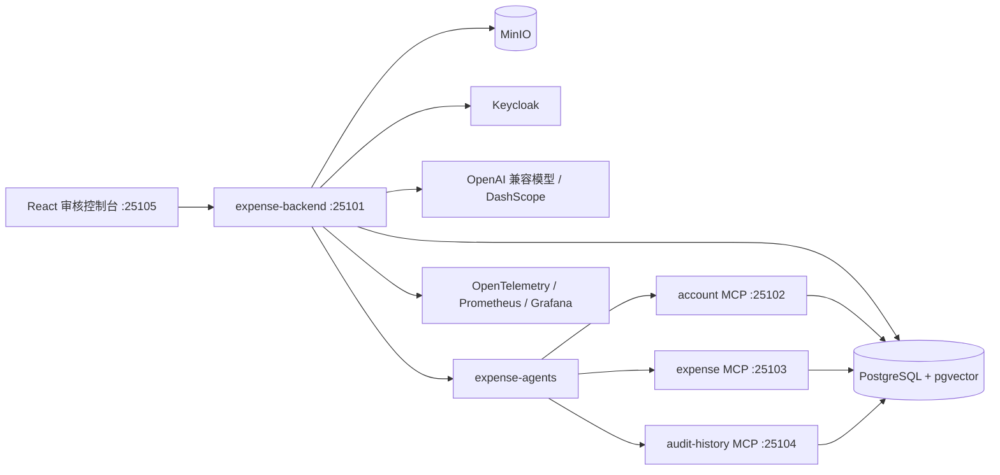

# ExpenseFlow


ExpenseFlow 是一个面向企业费用报销场景的智能审核系统，覆盖费用案例创建、票据上传、结构化抽取、制度检索、风险评分、人工复核、审批后结算、审计追踪和工作流观测等核心流程。

系统的设计重点不是让大模型直接做审批决策，而是让模型输出作为候选证据进入可控工作流。状态流转、金额校验、权限判断、幂等保护、人工复核和写入动作都由 Java 服务端负责，保证费用审核过程可追溯、可复核、可恢复。

## 功能范围

### 费用案例与票据

* 员工创建费用案例，填写申请人、部门、金额、币种和费用标题
* 支持 PDF、PNG、JPG、JPEG 票据上传，文件存储到 MinIO
* 记录票据 SHA-256、对象存储 Key、文件元数据和提取结果
* 支持票据结构化抽取，包含确定性抽取和 LLM/视觉模型抽取两种模式
* 工作流失败后可重新触发审核流程，并保留失败阶段和失败原因

### 制度检索与风险审核

* 支持企业费用制度导入、分块、向量化和版本管理
* 基于 PostgreSQL pgvector 执行制度 RAG 检索，返回制度片段、章节、版本和相似度
* 确定性风险引擎输出风险分值、风险等级和风险信号
* 覆盖金额超标、重复票据、缺少凭证、日期异常、商户异常、低置信度抽取等场景
* 中高风险案例自动进入人工复核队列，低风险案例可自动通过

### 人工复核与结算

* 审核员查看待处理任务、风险信号、制度引用、票据抽取结果和工作流证据
* 支持批准、驳回、要求补充材料和更多信息建议
* 高风险或疑似舞弊任务可限制为财务管理员处理
* 审批后结算通过受控写 Tool 提交报销和付款请求
* 写操作使用 requestId 做幂等保护，避免重复提交

### AI 治理与可观测性

* MCP Tool 分为只读 Tool 和审批后写 Tool，写 Tool 不允许被模型直接触发
* 记录工作流运行、Agent 步骤、模型调用、Token 用量、Tool 调用和错误信息
* 支持案例事件流，前端可以查看费用案例的执行时间线
* 内置风险评测、制度 RAG 评测和 Agent 安全评测数据集
* Prompt 模板支持提交、审核、启用和版本治理

## 系统架构



## 模块说明

| 模块 | 默认端口 | 说明 |
| --- | --- | --- |
| `app/orchestrator/expense-backend` | 25101 | 主业务 API，负责案例、票据、RAG、风险、复核、结算、评测和观测 |
| `app/orchestrator/expense-agents` | - | 多 Agent 计划、MCP Tool 目录和 MCP 客户端抽象 |
| `app/orchestrator/expense-common` | - | 共享领域状态、错误模型和 MCP 安全组件 |
| `app/business-api/account` | 25102 | 员工账户上下文 REST API 与 MCP 工具 |
| `app/business-api/expense` | 25103 | 费用业务 REST API 与 MCP 读写工具 |
| `app/business-api/audit-history` | 25104 | 审计历史 REST API 与 MCP 工具 |
| `app/frontend` | 25105 | React + Ant Design 审核控制台 |
| `deploy/keycloak` | - | Keycloak Realm 配置和演示账号初始化脚本 |

## 技术栈

| 分类 | 技术 |
| --- | --- |
| 后端 | Java 21、Spring Boot 3.5、Spring Security、Spring Validation、JdbcClient |
| 数据与迁移 | PostgreSQL、pgvector、Flyway、MinIO |
| AI 应用 | LangChain4j、MCP、RAG、OpenAI 兼容 Chat / Vision / Embedding 接口 |
| 身份认证 | Keycloak、OAuth2 Resource Server、JWT Realm Role、Audience 校验 |
| 前端 | React 19、TypeScript、Vite、Ant Design、TanStack Query、Zustand |
| 可观测性 | Spring Actuator、Micrometer、OpenTelemetry、Prometheus、Grafana |
| 测试 | JUnit 5、Mockito、Testcontainers、Vitest、Playwright |
| 工程化 | Maven 聚合工程、npm、OpenAPI TypeScript 类型生成 |

## 核心流程

### 费用审核流程

```text
员工创建费用案例
 -> 上传票据到 MinIO
 -> 票据结构化抽取
 -> 获取员工上下文和历史报销记录
 -> 检索适用费用制度
 -> 计算风险信号和风险等级
 -> 低风险自动通过 / 中高风险进入人工复核
 -> 审核员批准、驳回或要求补充材料
 -> 财务管理员发起审批后结算
 -> 记录审计日志、模型调用、Tool 调用和工作流事件
```

### 受控 MCP 写入流程

```text
案例已审批
 -> 服务端生成结算请求
 -> 校验角色、状态、金额和 requestId
 -> 调用 expense MCP 写 Tool
 -> 写入报销记录和付款请求
 -> 保存 Tool 调用结果和审批引用
```

### 制度 RAG 流程

```text
导入制度 Markdown
 -> 敏感信息脱敏与输入防护
 -> 按章节分块
 -> 生成 1024 维向量
 -> 写入 PostgreSQL pgvector
 -> 审核时按类别、地区、员工等级和日期检索制度片段
 -> 返回可追溯引用作为审核证据
```

## 快速开始

### 1. 环境要求

* JDK 21
* Maven 3.9+
* Node.js 20+
* PostgreSQL 15+，并启用 pgvector 扩展
* MinIO
* Keycloak
* 可选：OpenTelemetry Collector、Prometheus、Grafana、DashScope 或其他 OpenAI 兼容模型服务

### 2. 克隆项目

```bash
git clone https://github.com/yangaobo0235/my-expense-agent.git
cd my-expense-agent
```

### 3. 配置环境变量

本项目会读取项目根目录下的 `.env.local`，也可以通过操作系统环境变量或启动配置注入。

Windows PowerShell 示例：

```powershell
$env:EXPENSE_DATASOURCE_URL="jdbc:postgresql://127.0.0.1:5432/expense_flow"
$env:EXPENSE_DATASOURCE_USERNAME="postgres"
$env:EXPENSE_DATASOURCE_PASSWORD="your-password"

$env:EXPENSE_MINIO_ENDPOINT="http://127.0.0.1:9000"
$env:EXPENSE_MINIO_ACCESS_KEY="minioadmin"
$env:EXPENSE_MINIO_SECRET_KEY="minioadmin"
$env:EXPENSE_MINIO_BUCKET="expense-documents"

$env:KEYCLOAK_ISSUER_URI="http://localhost:18080/realms/expense-flow"
$env:KEYCLOAK_JWK_SET_URI="http://localhost:18080/realms/expense-flow/protocol/openid-connect/certs"
$env:KEYCLOAK_BACKEND_AUDIENCES="expense-backend"
```

如需接入 LLM/视觉抽取和向量模型：

```powershell
$env:DASHSCOPE_API_KEY="your-api-key"
$env:EXPENSE_EXTRACTION_MODE="llm"
$env:EXPENSE_EXTRACTION_MODEL_NAME="qwen-vl-plus"
$env:EXPENSE_AI_EMBEDDING_PROVIDER="dashscope"
```

如果只想离线跑通核心流程，可使用确定性降级模式：

```powershell
$env:EXPENSE_EXTRACTION_MODE="deterministic"
$env:EXPENSE_AI_EMBEDDING_PROVIDER="deterministic"
```

不要提交 `.env.local`、数据库密码、API Key、MinIO Secret Key、Keycloak Client Secret 或其他真实凭据。

### 4. 初始化数据库

首次运行前需要创建数据库，并启用 pgvector：

```sql
CREATE DATABASE expense_flow;
\c expense_flow;
CREATE EXTENSION IF NOT EXISTS vector;
```

业务表由 Flyway 在服务启动时自动创建。

### 5. 初始化 Keycloak

导入 `deploy/keycloak/expense-flow-realm.json` 后，可以执行脚本创建演示账号：

```powershell
powershell -ExecutionPolicy Bypass -File deploy/keycloak/init-expense-users.ps1
```

演示账号：

| 账号 | 密码 | 角色 |
| --- | --- | --- |
| `employee01` | `ExpenseFlow123!` | 员工，创建案例和上传票据 |
| `reviewer01` | `ExpenseFlow123!` | 审核员，处理人工复核任务 |
| `admin01` | `ExpenseFlow123!` | 财务管理员，审核、结算、Prompt 管理和观测 |

### 6. 启动后端服务

建议先确认当前终端使用 JDK 21：

```powershell
$env:JAVA_HOME="D:\software\jdk\jdk-21.0.6"
$env:Path="$env:JAVA_HOME\bin;$env:Path"
java -version
```

按以下顺序启动服务：

```powershell
mvn -pl app/orchestrator/expense-backend -am spring-boot:run
mvn -pl app/business-api/account -am spring-boot:run
mvn -pl app/business-api/expense -am spring-boot:run
mvn -pl app/business-api/audit-history -am spring-boot:run
```

常用访问地址：

| 服务 | 地址 |
| --- | --- |
| 后端 API | `http://localhost:25101` |
| Swagger UI | `http://localhost:25101/swagger-ui.html` |
| OpenAPI JSON | `http://localhost:25101/v3/api-docs` |
| account MCP | `http://localhost:25102/mcp` |
| expense MCP | `http://localhost:25103/mcp` |
| audit-history MCP | `http://localhost:25104/mcp` |

### 7. 启动前端

```powershell
cd app/frontend
npm ci
npm run dev
```

默认访问地址：`http://localhost:25105`

本地开发时如需跳过 Keycloak，可使用开发认证模式：

```powershell
$env:VITE_AUTH_MODE="development"
npm run dev
```

## 测试与构建

运行后端单元测试：

```powershell
$env:JAVA_HOME="D:\software\jdk\jdk-21.0.6"
$env:Path="$env:JAVA_HOME\bin;$env:Path"
mvn -q -DskipITs test
```

运行前端检查：

```powershell
cd app/frontend
npm ci
npm run typecheck
npm test -- --run
npm run build
```

运行 Playwright 端到端测试：

```powershell
cd app/frontend
npm run e2e
```

检查前端 OpenAPI 类型是否与后端一致：

```powershell
cd app/frontend
npm run api:check
```

后端接口变化后重新生成类型：

```powershell
cd app/frontend
npm run api:generate
```

## 项目结构

```text
my-expense-agent/
├── app/
│   ├── business-api/
│   │   ├── account/              # 账户上下文服务与 MCP 工具
│   │   ├── expense/              # 费用业务服务与 MCP 工具
│   │   └── audit-history/        # 审计历史服务与 MCP 工具
│   ├── frontend/                 # React 审核控制台
│   └── orchestrator/
│       ├── expense-backend/      # 主业务编排服务
│       ├── expense-agents/       # Agent 计划和 MCP 客户端
│       └── expense-common/       # 通用领域模型和安全组件
├── deploy/
│   └── keycloak/                 # Keycloak Realm 与演示账号脚本
├── pom.xml                       # Maven 聚合工程
├── README.md
└── LICENSE
```

## 安全说明

* 模型输出只能作为候选证据，不能直接审批、驳回、付款或修改案例状态。
* 员工只能访问本人费用案例，审核员和财务管理员具备受控的跨案例权限。
* MCP 只读 Tool 和写 Tool 分离，写 Tool 仅在审批后结算阶段开放。
* 所有写入类 Tool 调用必须携带幂等 requestId 和审批引用。
* 证据问答只能基于当前案例证据回答，不能请求密码、Token、银行密钥等敏感信息。
* 生产环境应使用独立密钥、最小权限账号和 HTTPS，并关闭敏感调试日志。
* 提交代码前请确认 `.env.local`、日志、临时文件和真实凭据未进入 Git。

## 项目边界

* 当前结算流程会持久化内部报销和付款请求，未对接真实银行、银企直连或 ERP 支付通道。
* LLM/视觉抽取依赖外部模型服务，确定性抽取器主要用于离线演示和降级。
* 内置评测集用于工程质量基线，不代表真实企业制度的完整覆盖范围。
* 本项目是学习与作品集项目，生产部署前仍需补充容量评估、权限审计、告警策略和容灾设计。

## License

本项目基于 [MIT License](LICENSE) 开源。
