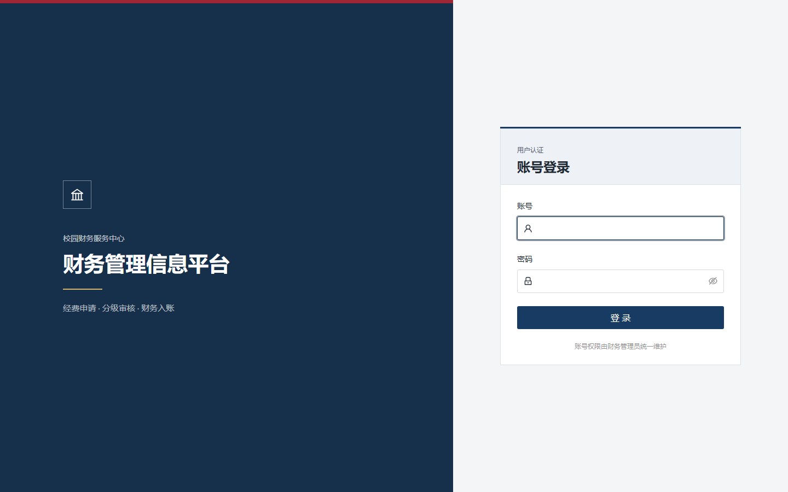
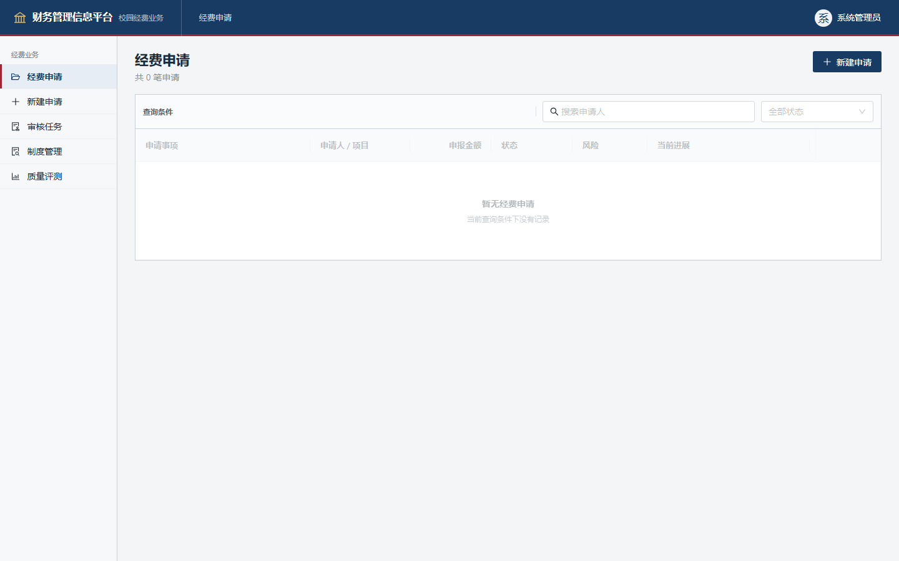
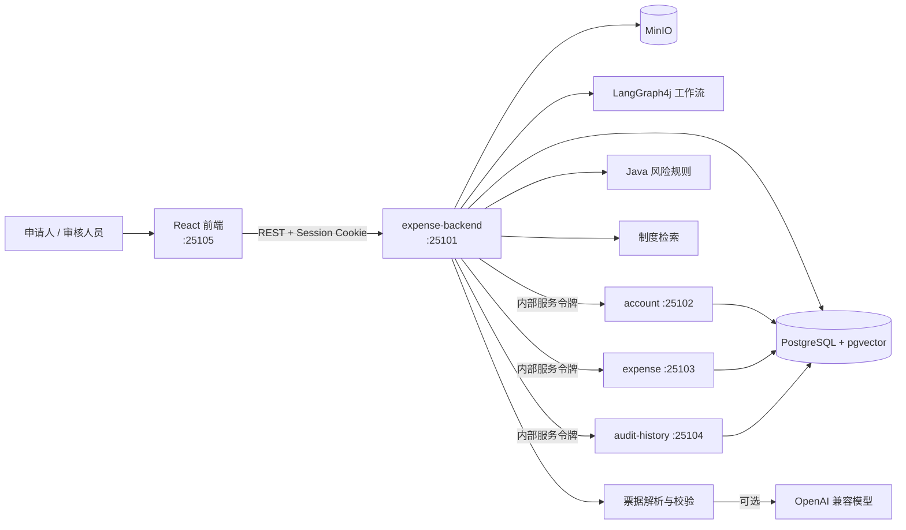

# MyExpenseAgent

[](https://github.com/yangaobo0235/my-expense-agent/actions/workflows/ci.yml)
[](LICENSE)

面向高校经费报销场景的可审计智能合规平台，覆盖申请、票据解析、制度检索、风险分流、人工复核、审批后入账和审计追踪。

## 核心能力

- 管理经费申请以及 PDF、PNG、JPG、JPEG 票据材料。
- 将票据解析为结构化数据，并校验金额、日期、币种和明细。
- 使用 LangGraph4j 编排证据收集、制度核对、风险评估和人工复核。
- 使用 PostgreSQL 与 pgvector 返回可追溯的制度版本和章节引用。
- 通过受保护的 MCP 服务读取项目、预算和历史报销上下文。
- 将只读工具与审批后写工具分离，写入前校验权限、状态和幂等标识。
- 保存文档版本、工作流步骤、模型调用、工具调用和审计事件。

模型只提供候选事实和辅助证据。风险等级、审核路由、人工决定和财务入账始终由服务端规则与权限控制。

## 界面预览

登录入口：



经费申请工作台（使用空数据响应拍摄，不包含真实业务数据）：



## 系统架构


```mermaid
flowchart LR
    User["申请人 / 审核人员"] --> Web["React 前端<br/>:25105"]
    Web -->|"REST + Session Cookie"| Backend["expense-backend<br/>:25101"]
    Backend --> PostgreSQL[("PostgreSQL + pgvector")]
    Backend --> MinIO[("MinIO")]
    Backend --> Graph["LangGraph4j 工作流"]
    Backend --> Extract["票据解析与校验"]
    Backend --> Risk["Java 风险规则"]
    Backend --> Rag["制度检索"]
    Extract -->|"可选"| Model["OpenAI 兼容模型"]

    Backend -->|"内部服务令牌"| Account["account :25102"]
    Backend -->|"内部服务令牌"| Expense["expense :25103"]
    Backend -->|"内部服务令牌"| Audit["audit-history :25104"]
    Account --> PostgreSQL
    Expense --> PostgreSQL
    Audit --> PostgreSQL
```

浏览器认证使用 Spring Security Session、HttpOnly Cookie 和 CSRF Token。三个 MCP 服务使用独立的服务令牌，不与用户会话混用。

## 业务流程

```text
创建申请
  -> 上传票据到 MinIO
  -> 票据解析与字段校验
  -> 收集申请人、预算和历史证据
  -> 检索适用制度
  -> Java 规则计算风险并路由
  -> 补充材料 / 人工复核
  -> 审批后受控入账
  -> 保存完整审计链路
```

## 模块

| 模块 | 端口 | 职责 |
| --- | ---: | --- |
| `expense-backend` | 25101 | 主业务 API、账号认证、审核编排和受控入账 |
| `expense-agents` | - | MCP 工具目录、执行策略和客户端抽象 |
| `expense-common` | - | 共享领域状态、MCP 安全组件和通用契约 |
| `account` | 25102 | 申请人、学院和项目上下文 |
| `expense` | 25103 | 预算、历史报销和审批后入账 |
| `audit-history` | 25104 | 审核历史与审计写入 |
| `frontend` | 25105 | 经费申请、审核、制度和评测工作台 |

## 角色权限

| 角色 | 主要权限 |
| --- | --- |
| `STUDENT` | 创建、查看和维护自己的申请，提交补充材料 |
| `ADVISOR` | 查看申请并处理指导教师审核任务 |
| `COLLEGE_REVIEWER` | 学院审核、查看制度和质量评测 |
| `FINANCE_ADMIN` | 财务复核、制度管理和审批后入账 |
| `AUDITOR` | 只读查看申请、审核记录、制度、评测与审计链路 |

初始管理员拥有以上全部角色。

## 技术栈

| 分类 | 技术 |
| --- | --- |
| 后端 | Java 21、Spring Boot 3.5、Spring Security、Spring Session JDBC、JdbcClient |
| AI 编排 | LangGraph4j、LangChain4j、MCP Java SDK |
| 数据 | PostgreSQL、pgvector、Flyway、MinIO |
| 前端 | React 19、TypeScript、Vite、Ant Design、TanStack Query、Zustand |
| 测试 | JUnit 5、Testcontainers、Vitest、Testing Library、Playwright |

## 项目结构

```text
my-expense-agent/
|-- .github/workflows/       # 持续集成
|-- app/
|   |-- business-api/        # account、expense、audit-history MCP 服务
|   |-- frontend/            # React 前端
|   `-- orchestrator/        # 主后端、Agent 适配器和共享契约
|-- deploy/                  # 可提交的配置模板
|-- docs/                    # 设计与实施记录
|-- scripts/                 # 本地辅助脚本
|-- pom.xml                  # Maven 聚合工程
`-- README.md
```

## 环境要求

- JDK 21
- Maven 3.9+
- Node.js 20+
- PostgreSQL 15+，数据库账号需要创建 `pgvector` 扩展的权限
- MinIO
- OpenAI 兼容多模态模型服务，可选；离线开发可使用确定性解析器

## 快速开始

### 1. 获取代码

```powershell
git clone https://github.com/yangaobo0235/my-expense-agent.git
Set-Location my-expense-agent
```

### 2. 创建本地配置

```powershell
Copy-Item deploy/.env.example .env.local
Copy-Item app/frontend/.env.example app/frontend/.env.local
```

编辑 `.env.local`，至少填写 PostgreSQL、MinIO、管理员密码和 MCP 服务令牌。不要提交该文件。

```properties
EXPENSE_DATASOURCE_URL=jdbc:postgresql://localhost:5432/my_expense_agent
EXPENSE_DATASOURCE_USERNAME=<application-user>
EXPENSE_DATASOURCE_PASSWORD=<local-database-password>

EXPENSE_MINIO_ENDPOINT=http://localhost:9000
EXPENSE_MINIO_ACCESS_KEY=<local-access-key>
EXPENSE_MINIO_SECRET_KEY=<local-secret-key>

EXPENSE_BOOTSTRAP_ADMIN_USERNAME=admin
EXPENSE_BOOTSTRAP_ADMIN_PASSWORD=<set-a-strong-password>
EXPENSE_MCP_SERVICE_TOKEN=<random-value-at-least-32-characters>
```

生产环境应使用部署平台的密钥管理能力注入这些值，而不是创建 `.env.local`。

### 3. 可选的本地演示账号

仅在一次性本地数据库中显式启用：

```properties
EXPENSE_DEMO_USERS_ENABLED=true
```

启用后会创建以下缺失账号；密码仅用于本地演示，均与账号名相同。该初始化不会重置已有账号密码。

| 账号 | 角色 |
| --- | --- |
| `student` | 学生 |
| `advisor` | 指导教师 |
| `college_reviewer` | 学院审核员 |
| `finance_admin` | 财务管理员 |
| `auditor` | 审计员 |

禁止在共享、测试验收或生产环境启用演示账号。

### 4. 初始化数据库

```sql
CREATE DATABASE my_expense_agent;
```

主后端首次启动时由 Flyway 创建 pgvector 扩展、业务表、认证表和 Spring Session 表。

### 5. 构建后端

确认终端使用 JDK 21：

```powershell
$env:JAVA_HOME='<JDK 21 installation directory>'
java -version
mvn clean package
```

### 6. 启动服务

在四个终端中从仓库根目录启动：

```powershell
java -jar app/business-api/account/target/account-1.0.0-SNAPSHOT.jar
java -jar app/business-api/expense/target/expense-1.0.0-SNAPSHOT.jar
java -jar app/business-api/audit-history/target/audit-history-1.0.0-SNAPSHOT.jar
java -jar app/orchestrator/expense-backend/target/expense-backend-1.0.0-SNAPSHOT.jar
```

四个服务必须读取同一个 `EXPENSE_MCP_SERVICE_TOKEN`。

### 7. 启动前端

```powershell
Set-Location app/frontend
npm ci
npm run dev
```

## 访问入口

| 入口 | 地址 |
| --- | --- |
| 前端 | `http://localhost:25105` |
| Swagger UI | `http://localhost:25101/swagger-ui.html` |
| OpenAPI JSON | `http://localhost:25101/v3/api-docs` |
| 主服务健康检查 | `http://localhost:25101/actuator/health` |

## 主要配置

| 配置 | 说明 |
| --- | --- |
| `EXPENSE_DATASOURCE_*` | PostgreSQL 连接 |
| `EXPENSE_MINIO_*` | MinIO API、密钥和 Bucket |
| `EXPENSE_BOOTSTRAP_ADMIN_*` | 首次启动管理员；密码为空时不创建 |
| `EXPENSE_DEMO_USERS_ENABLED` | 是否创建本地演示账号，默认 `false` |
| `EXPENSE_SESSION_*` | Session 时长和 Cookie 安全属性 |
| `EXPENSE_MCP_SERVICE_TOKEN` | 主后端与三个 MCP 服务共享的内部令牌 |
| `EXPENSE_MCP_*_URL` | 三个 MCP 服务地址 |
| `EXPENSE_EXTRACTION_*` | 票据解析模式、模型、地址、密钥和超时 |
| `EXPENSE_AI_EMBEDDING_*` | 制度向量模型和维度 |
| `EXPENSE_ALLOWED_ORIGINS` | 允许携带 Cookie 的前端来源 |
| `VITE_API_BASE_URL` | 前端访问的主后端地址 |
| `VITE_AUTH_MODE` | `session` 或仅用于本地 UI 的 `development` |
| `VITE_MOCK_API` | 设置为 `msw` 时使用浏览器 Mock API |

生产环境通过 HTTPS 部署时必须设置 `EXPENSE_SESSION_COOKIE_SECURE=true`。

## 测试

后端测试：

```powershell
$env:JAVA_HOME='<JDK 21 installation directory>'
mvn test
```

前端测试：

```powershell
Set-Location app/frontend
npm run typecheck
npm test
npm run build
npm run e2e
```

外部 PostgreSQL、MinIO 和 MCP 集成测试通过显式环境变量启用，并会清理其创建的测试数据。CI 默认执行单元测试、Testcontainers 数据库测试、前端构建和浏览器端到端测试。

## 安全说明

- 密码以 BCrypt 哈希保存，浏览器不保存访问令牌。
- Session 保存在 PostgreSQL，刷新页面和后端多实例部署时可以恢复。
- Cookie 认证开启 CSRF 防护，不要为联调关闭它。
- MCP 服务令牌应使用至少 32 字符的随机值，并只放在本地配置或密钥系统中。
- 数据库和 MinIO 不应使用超级管理员账号运行生产服务。
- `.env.local`、日志、构建产物和测试报告不得提交到 Git。
- 安全问题请按 [SECURITY.md](SECURITY.md) 私下报告。

## License

本项目使用 [MIT License](LICENSE)。
