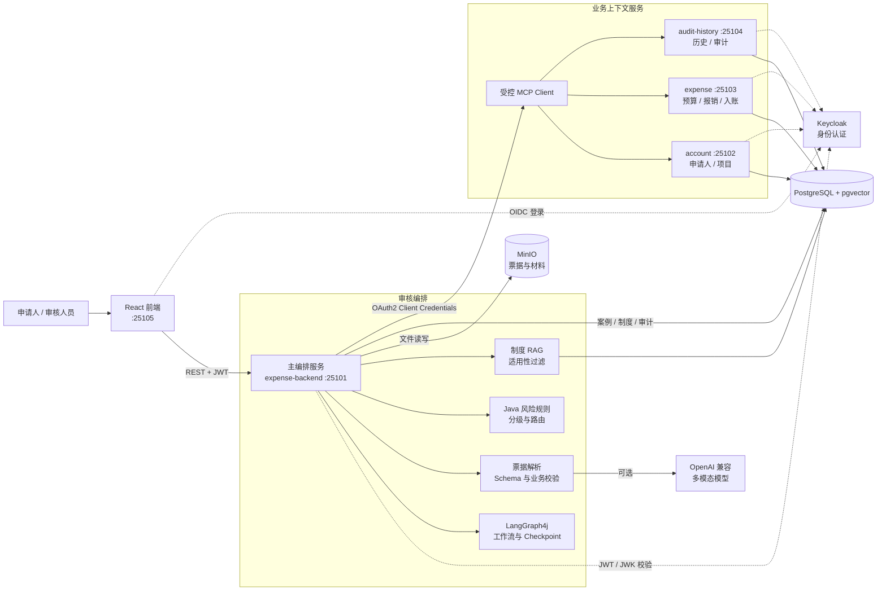

# my-expense-agent

面向高校经费报销场景的智能合规审核平台，覆盖票据解析、制度检索、风险分流、人工复核、审批后入账和全链路审计。

## 功能概览

- 管理经费报销申请以及 PDF、PNG、JPG、JPEG 票据材料。
- 将票据解析为结构化数据，并校验必填字段、金额、日期、币种和明细合计。
- 通过 LangGraph4j 编排材料检查、风险审核、补充材料、学院复核和财务复核。
- 使用 PostgreSQL/pgvector 检索与申请条件匹配的制度版本和章节引用。
- 使用 Java 规则检查预算、金额一致性、重复票据和异常材料。
- 通过 MCP 获取申请人、项目、预算和历史报销上下文。
- 将只读 Tool 与审批后写 Tool 分离，写入前校验权限、状态和幂等标识。
- 保存文档版本、工作流运行、检查点、模型调用、Tool 调用和审计事件。

## 系统架构


```mermaid
flowchart LR
    User["申请人 / 审核人员"] --> Web["React 前端<br/>:25105"]
    Web -->|"REST + JWT"| Backend["主编排服务<br/>expense-backend :25101"]
    Web -.->|"OIDC 登录"| Keycloak["Keycloak<br/>身份认证"]
    Backend -.->|"JWT / JWK 校验"| Keycloak

    subgraph Review["审核编排"]
        Backend --> Graph["LangGraph4j<br/>工作流与 Checkpoint"]
        Backend --> Extract["票据解析<br/>Schema 与业务校验"]
        Backend --> Risk["Java 风险规则<br/>分级与路由"]
        Backend --> Rag["制度 RAG<br/>适用性过滤"]
    end

    Backend -->|"文件读写"| MinIO[("MinIO<br/>票据与材料")]
    Backend -->|"案例 / 制度 / 审计"| PostgreSQL[("PostgreSQL + pgvector")]
    Extract -->|"可选"| Model["OpenAI 兼容<br/>多模态模型"]
    Rag --> PostgreSQL

    Backend -->|"OAuth2 Client Credentials"| McpGateway["受控 MCP Client"]

    subgraph Context["业务上下文服务"]
        McpGateway --> Account["account :25102<br/>申请人 / 项目"]
        McpGateway --> Expense["expense :25103<br/>预算 / 报销 / 入账"]
        McpGateway --> Audit["audit-history :25104<br/>历史 / 审计"]
    end

    Account --> PostgreSQL
    Expense --> PostgreSQL
    Audit --> PostgreSQL
    Account -.-> Keycloak
    Expense -.-> Keycloak
    Audit -.-> Keycloak
```

关键安全边界：模型只提供票据候选事实；风险等级、审核路由、人工审批和入账始终由服务端规则与权限控制。

## 核心流程

```text
创建报销申请
 -> 上传 PDF/图片票据到 MinIO
 -> 结构化解析
 -> JSON Schema 与 Java 业务校验
 -> 最多一次定向修正 / 转人工
 -> LangGraph4j 收集 MCP 与制度证据
 -> 材料检查与 Java 风险审核
 -> 补材料 / 学院复核 / 财务复核 / 低风险路径
 -> 人工审批
 -> MCP 审批后写入
 -> 保存 Run、Checkpoint、模型、Tool 与审计链路
```

## 模块说明

| 模块 | 端口 | 职责 |
| --- | ---: | --- |
| `expense-backend` | 25101 | 主业务 API、票据解析、制度检索、审核图、人工复核和受控入账 |
| `expense-agents` | - | 执行策略、MCP Tool 目录、Tool 路由和客户端抽象 |
| `expense-common` | - | 共享领域状态、安全组件、错误模型和通用契约 |
| `account` | 25102 | 申请人、学院和项目上下文 REST API 与只读 MCP Tool |
| `expense` | 25103 | 预算、历史报销以及审批后入账 REST API 与 MCP Tool |
| `audit-history` | 25104 | 审核历史、申请事件和审计写入 REST API 与 MCP Tool |
| `frontend` | 25105 | 申请、票据、审核、制度、评测和案例追踪界面 |

## 技术栈

| 分类 | 技术 |
| --- | --- |
| 后端 | Java 21、Spring Boot 3.5、Spring Security、JdbcClient |
| AI 编排 | LangGraph4j、LangChain4j、MCP Java SDK |
| 数据 | PostgreSQL、pgvector、Flyway、MinIO |
| 身份认证 | Keycloak、OAuth2、JWT、PKCE |
| 前端 | React 19、TypeScript、Vite、Ant Design、TanStack Query、Zustand |
| 测试 | JUnit 5、Vitest、Testing Library、Playwright |

## 项目结构

```text
my-expense-agent/
|-- app/
|   |-- business-api/
|   |   |-- account/             # 申请人和项目上下文服务
|   |   |-- expense/             # 预算、报销和入账服务
|   |   `-- audit-history/       # 审核历史和审计服务
|   |-- frontend/                # React 前端
|   `-- orchestrator/
|       |-- expense-backend/     # 主编排服务
|       |-- expense-agents/      # 工作流策略和 MCP 客户端
|       `-- expense-common/      # 共享领域与安全组件
|-- deploy/
|   |-- .env.example             # 后端配置模板
|   `-- keycloak/                # Realm 配置与用户初始化脚本
|-- pom.xml                      # Maven 聚合工程
|-- README.md
`-- LICENSE
```

## 环境要求

- JDK 21
- Maven 3.9+
- Node.js 20+
- PostgreSQL 15+，数据库账号需要具备创建 pgvector 扩展的权限
- MinIO
- Keycloak
- OpenAI 兼容的多模态模型服务（可选）

默认端口：

| 组件 | 端口 |
| --- | ---: |
| PostgreSQL | 5432 |
| MinIO API | 9000 |
| MinIO Console | 9001 |
| Keycloak | 18080 |

## 快速开始

### 1. 获取代码

```powershell
git clone https://github.com/yangaobo0235/my-expense-agent.git
Set-Location my-expense-agent
```

### 2. 准备配置

从仓库中的模板创建本地配置：

```powershell
Copy-Item deploy/.env.example .env.local
Copy-Item app/frontend/.env.example app/frontend/.env.local
```

编辑两个 `.env.local` 文件，填写 PostgreSQL、MinIO、Keycloak 和模型服务的实际地址与密钥。本地配置已被 Git 忽略。

### 3. 初始化 PostgreSQL

先创建空数据库：

```sql
CREATE DATABASE my_expense_agent;
```

主编排服务首次启动时会通过 Flyway 自动创建 pgvector 扩展和业务表，不需要手工执行迁移 SQL。

### 4. 初始化 Keycloak

在 Keycloak 管理控制台中导入：

```text
deploy/keycloak/my-expense-agent-realm.json
```

如需初始化本地用户、Web Origin 和后端 Client Secret，可执行：

```powershell
./deploy/keycloak/init-campus-users.ps1 `
  -AdminPassword (Read-Host 'Keycloak 管理员密码') `
  -UserPassword (Read-Host '本地用户密码') `
  -BackendClientSecret $env:KEYCLOAK_BACKEND_CLIENT_SECRET
```

`KEYCLOAK_BACKEND_CLIENT_SECRET` 应与 `.env.local` 中的 `EXPENSE_MCP_CLIENT_SECRET` 保持一致。

### 5. 构建并启动后端

确认当前终端使用 JDK 21，然后构建 Maven 聚合工程：

```powershell
java -version
mvn clean package
```

分别在四个终端中按以下顺序启动服务：

```powershell
java -jar app/business-api/account/target/account-1.0.0-SNAPSHOT.jar
java -jar app/business-api/expense/target/expense-1.0.0-SNAPSHOT.jar
java -jar app/business-api/audit-history/target/audit-history-1.0.0-SNAPSHOT.jar
java -jar app/orchestrator/expense-backend/target/expense-backend-1.0.0-SNAPSHOT.jar
```

### 6. 启动前端

```powershell
Set-Location app/frontend
npm ci
npm run dev
```

## 访问入口

| 入口 | 地址 |
| --- | --- |
| 前端 | `http://localhost:25105` |
| 后端 API | `http://localhost:25101` |
| Swagger UI | `http://localhost:25101/swagger-ui.html` |
| OpenAPI JSON | `http://localhost:25101/v3/api-docs` |
| 健康检查 | `http://localhost:25101/actuator/health` |

## 配置说明

后端读取根目录 `.env.local`，完整模板位于 `deploy/.env.example`。主要配置如下：

| 配置 | 说明 |
| --- | --- |
| `EXPENSE_DATASOURCE_*` | PostgreSQL 地址和账号 |
| `EXPENSE_MINIO_*` | MinIO API 地址、密钥和 Bucket |
| `KEYCLOAK_*` | Realm issuer、JWK 地址和 audience |
| `EXPENSE_MCP_*` | Client Credentials 与三个 MCP 服务地址 |
| `EXPENSE_EXTRACTION_*` | 票据解析模式、模型、地址、密钥和超时 |
| `EXPENSE_AI_EMBEDDING_*` | 制度向量模型和维度 |
| `EXPENSE_ALLOWED_ORIGINS` | 后端允许的前端来源 |

票据解析支持两种运行方式：

```properties
# 调用多模态模型
EXPENSE_EXTRACTION_MODE=llm
EXPENSE_EXTRACTION_MODEL_NAME=gpt-5.4
EXPENSE_EXTRACTION_BASE_URL=https://api.openai.com/v1
EXPENSE_EXTRACTION_API_KEY=change-me

# 不调用外部模型，用于离线开发
EXPENSE_EXTRACTION_MODE=deterministic
```

前端配置位于 `app/frontend/.env.local`：

| 配置 | 说明 |
| --- | --- |
| `VITE_API_BASE_URL` | 主后端地址 |
| `VITE_AUTH_MODE` | `keycloak` 或本地开发模式 `development` |
| `VITE_MOCK_API` | 设置为 `msw` 时使用浏览器 Mock API |
| `VITE_KEYCLOAK_*` | Keycloak 地址、Realm 和 Web Client ID |

## 关键接口

除健康检查外，业务接口需要携带 Keycloak Bearer Token。

| 接口 | 用途 |
| --- | --- |
| `POST /api/v1/fund-applications/{caseId}/documents` | 上传票据 |
| `POST /api/v1/fund-applications/{caseId}/analyze` | 解析并校验案例内票据 |
| `POST /api/v1/expense-cases/{caseId}/review-runs` | 审核、重审或恢复 |
| `GET /api/v1/expense-cases/{caseId}/trace` | 查询案例完整链路 |
| `GET /api/v1/policies/search` | 检索适用制度及章节引用 |
| `POST /api/v1/review-tasks/{taskId}/approve` | 人工审批 |
| `POST /api/v1/fund-applications/{caseId}/posting` | 审批后受控入账 |
| `GET /api/v1/evaluations/extraction/latest` | 票据解析回归报告 |
| `GET /api/v1/evaluations/risk/latest` | 风险分流回归报告 |

## 测试与构建

后端：

```powershell
mvn test
mvn clean package
```

前端：

```powershell
Set-Location app/frontend
npm run typecheck
npm test
npm run build
```

端到端测试要求前端、Keycloak 和四个 Java 服务已经启动：

```powershell
npm run e2e
```

## 常见问题

- `Flyway` 报告同版本迁移重复时，先执行 `mvn clean package`，避免旧资源残留在 `target` 中。
- 登录失败时，检查前后端配置的 Keycloak 地址、Realm、Client ID、Client Secret 和系统时间。
- MinIO 客户端必须连接 API 端口 `9000`，不能使用 Console 端口 `9001`。
- 修改后端接口后，可在前端目录执行 `npm run api:generate` 更新 OpenAPI TypeScript 类型。

## 数据与安全

- 模型输出只作为票据候选事实，不直接决定风险等级、审核路由、审批或入账。
- MCP 写 Tool 只能由人工审批后的服务端流程触发，并要求稳定的 `requestId`。
- 仓库中的评测案例均为合成数据，不包含真实票据或个人信息。
- `.env.local`、服务密钥、日志、构建产物和本地临时文件不应提交到 Git。
- 当前业务服务用于模拟校内上下文和审批后入账边界，未连接真实高校财务系统。

## License

本项目使用 [MIT License](LICENSE)。
